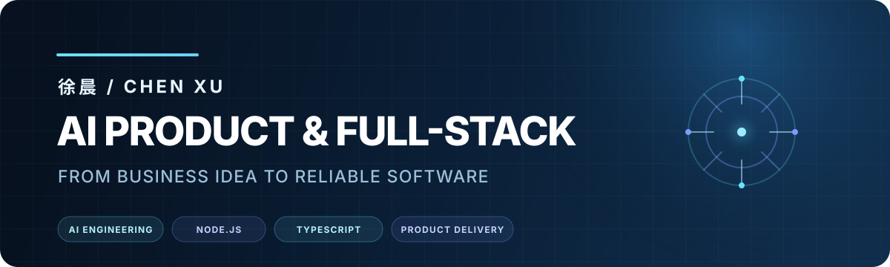
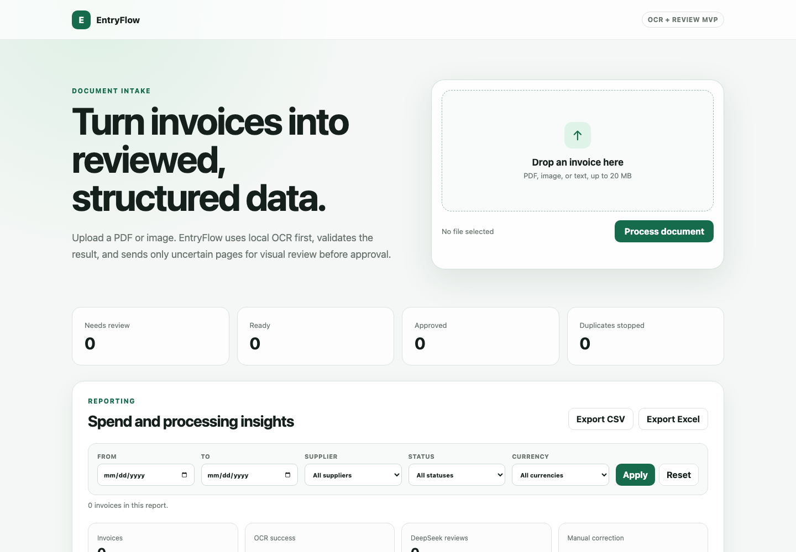
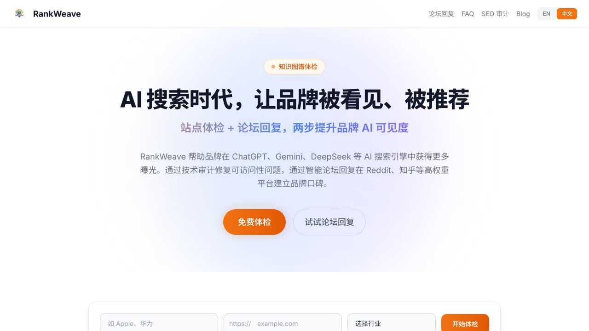
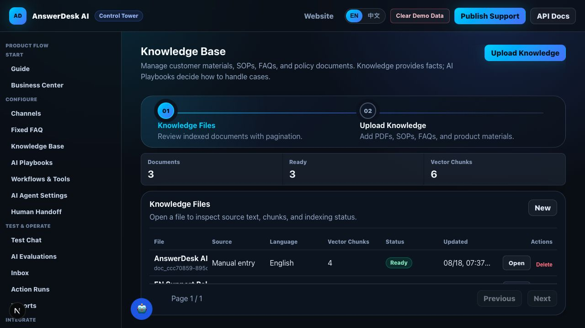

<p align="right">
  <a href="https://github.com/shadow88sky"><strong>中文</strong></a> · <strong>English</strong>
</p>

<p align="center">
  <a href="http://39.102.50.88/">
    
  </a>
</p>

<p align="center">
  <strong>15 years of building production software, from business requirements to reliable delivery</strong><br />
  AI products · Web3 infrastructure · Web2 systems
</p>

<p align="center">
  <a href="#01--ai-products--agents"><strong>AI</strong></a>
  &nbsp;·&nbsp;
  <a href="#02--web3--blockchain-systems"><strong>Web3</strong></a>
  &nbsp;·&nbsp;
  <a href="#03--web2-full-stack--enterprise-systems"><strong>Web2</strong></a>
  &nbsp;│&nbsp;
  <a href="http://39.102.50.88/"><strong>Portfolio</strong></a>
  &nbsp;·&nbsp;
  <a href="http://39.102.50.88/resume-en.html"><strong>Résumé</strong></a>
  &nbsp;·&nbsp;
  <a href="mailto:119136016@qq.com?subject=Project%20Inquiry"><strong>Contact</strong></a>
</p>

---

### Hi, I’m Chen Xu 👋

I am a full-stack and backend engineer with **15 years of professional software development experience** across **Web2 enterprise systems, Web3 infrastructure, and AI products**. My primary stack is **Node.js, TypeScript, NestJS, React, and PostgreSQL**. I also use Go, Python, Solidity, and cloud-native tooling where they are the right fit.

My experience ranges from nationwide workforce systems, enterprise BFF platforms, public services, and large live-event systems to crypto wallets, cross-chain services, Web3 data products, RAG applications, business agents, GEO tooling, and document OCR. I can take a product from an ambiguous requirement through architecture and delivery, or join an existing codebase to solve backend, database, integration, performance, deployment, and production issues.

> **Available for freelance projects and long-term remote collaboration.** I work in written English and Chinese and can start with an MVP, a critical module, or an existing-system upgrade.

### Three Focus Areas

| AI Product Engineering | Web3 Systems Engineering | Web2 Full-Stack Engineering |
| --- | --- | --- |
| RAG, agents, OCR, multi-model orchestration, knowledge bases, and business automation | Wallets, cross-chain systems, multi-chain integration, on-chain data, smart contracts, and Web3 APIs | Node.js backends, SaaS products, admin systems, microservices, databases, and infrastructure |

## 01 · AI Products & Agents

Since 2023, I have built production-oriented AI products covering RAG, vector search, web search and crawling, tool calling, structured output, state machines, human review, multi-model orchestration, and failure handling.

### EntryFlow · Invoice OCR, Review, and Reporting

An OCR-first invoice processing application. It runs local OCR and deterministic financial validation first, then sends only missing, inconsistent, or unclear pages to a vision model for review. This design controls cost while improving reliability.

<p align="center">
  <a href="http://39.102.50.88/entryflow/"></a>
</p>

- PDF and image OCR, field and amount validation, duplicate detection, and edit history
- Approval and payment states, monthly and supplier reports, CSV and Excel exports

**FastAPI · SQLite · Tesseract · Poppler · DeepSeek**<br />
[Live Demo](http://39.102.50.88/entryflow/) · [Technical Case Study](http://39.102.50.88/projects/entryflow.html) · [Source Code](https://github.com/shadow88sky/entryflow)

### RankWeave · AI Brand Visibility and GEO Platform

A GEO platform that measures brand mentions, citations, and competitor position across multiple AI search engines, then provides site diagnostics, content generation, and continuous monitoring.

<p align="center">
  <a href="http://39.102.50.88:8081"></a>
</p>

- Concurrent multi-model execution, engine isolation, partial success, and SSE progress updates
- Brand and competitor analysis, citation aggregation, AI crawler, Schema.org, and SEO audits

**Next.js · React · NestJS · PostgreSQL · TypeORM**<br />
[Product Demo](http://39.102.50.88:8081) · [Technical Case Study](http://39.102.50.88/projects/rankweave.html) · [Open-Source Audit Tool](https://github.com/shadow88sky/rankweave-geo-audit)

### AnswerDesk AI · Configurable Business Support Agent

A business execution platform that connects knowledge retrieval, field collection, external tools, and human handoff through configurable workflows. It supports a website widget, Telegram bot, and REST API.

<p align="center">
  <a href="http://39.102.50.88:8082"></a>
</p>

- Hybrid RAG, reciprocal rank fusion, source tracing, playbooks, and structured output
- Webhook tools, timeouts and retries, low-confidence handoff, and complete execution traces

**Next.js · TypeScript · PostgreSQL · Qdrant · LangChain**<br />
[Product Demo](http://39.102.50.88:8082) · [Technical Case Study](http://39.102.50.88/projects/answerdesk.html)

## 02 · Web3 & Blockchain Systems

My Web3 experience covers wallet authentication, multi-chain node integration, cross-chain state management, on-chain data pipelines, relationship graphs, Web3 search, and smart contracts.

### Wallet and Cross-Chain Systems · Tomo / World Liberty Financial

- Built registration, authentication, and wallet-generation modules from the ground up, including deep integration with Cubist security infrastructure
- Integrated Ethereum, Solana, Base, BSC, Tron, and TON
- Used idempotency, state machines, caching, observability, and recovery flows to handle node instability and different confirmation times

**Node.js · TypeScript · Cubist · Multi-chain · State Machine**

### TypoGraphy AI / TypoCurator · KNN3 Network

- Led development of a RAG-based Web3 AI search engine using OpenAI / Llama2, LangChain, Milvus, and multiple Web3 protocols; its external API was purchased and integrated by third-party projects
- Led a Telegram / TON data curation platform that reached 30,000 users in its first week and 70,000 in total, and received a TON Grant

[TypoGraphy AI Case Study](http://39.102.50.88/projects/typoai.html) · [Official Product Article](https://medium.com/knn3-network/typography-ai-v2-0-product-upgrade-7a9d9601722c)

### MeshGraph · Wallet Relationships and On-Chain Data

Built a Geth-based data pipeline combining full Ethereum blocks with TheGraph, Snapshot, .bit, and other sources. ClickHouse, GraphQL APIs, and an SDK powered wallet relationships, NFT and token holdings, and visual analysis.

[KNN3 SDK](https://github.com/KNN3-Network/KNN3-SDK) · [OAuth Callback Service](https://github.com/KNN3-Network/oauth-server) · [Snapshot Data Sync](https://github.com/KNN3-Network/snapshot)

### SecureDeal · Smart-Contract Payment Trust

A Solidity contract project that uses on-chain rules to reduce trust risk in online paid transactions.

[View Solidity Source](https://github.com/shadow88sky/SecureDeal)

## 03 · Web2 Full-Stack & Enterprise Systems

I have worked on production Web2 systems since 2011, with experience in enterprise backends, microservices, SaaS consoles, data services, high-traffic events, infrastructure, and engineering leadership.

### Enterprise Platforms and Infrastructure · GaiaWorks

- Designed a reusable NestJS BFF framework with modular Redis, MySQL, encryption, signing, and request forwarding
- Built shared URL-shortening, verification-code, and Excel-to-PDF services, and led delivery of a low-code platform, visual editor, and online IDE
- Moved services to Docker and Kubernetes and built a frontend telemetry and ELK analysis pipeline

### Zero-to-One Products and High-Traffic Events

- Built and managed an engineering team of more than 10 people, covering architecture, hiring, process, code review, and delivery
- Established a microservice stack with Kong, ELK, Elasticsearch, and Go
- Supported a Budweiser electronic music event for 10,000 attendees at a peak of 400 QPS with stable operation

### Long-Running Production Systems

- Contributed to backend upgrades and query-performance improvements for the Qixinbao business-information app
- Developed and maintained attendance, working-hours, and monthly payroll systems used by McDonald’s stores across China
- Delivered railway Wi-Fi onboarding, location services, traffic monitoring, and an operations dashboard for Guangzhou Railway

### Node.js Open-Source Work

| Project | Focus |
| --- | --- |
| [Nest-WebSocket](https://github.com/shadow88sky/Nest-WebSocket) | NestJS WebSocket and service communication |
| [nest-grpc](https://github.com/shadow88sky/nest-grpc) | NestJS gRPC service example |
| [mongoose-api](https://github.com/shadow88sky/mongoose-api) | Node.js and MongoDB API utilities |
| [shadow-mysql](https://github.com/shadow88sky/shadow-mysql) | MySQL interface package |
| [excelToPdf](https://github.com/shadow88sky/excelToPdf) | Excel-to-PDF conversion service |

## Technology Stack

```text
AI / Search     RAG · Agent Workflows · Tool Calling · LangChain · DeepSeek · OpenAI · Gemini
Backend         Node.js · TypeScript · NestJS · Go · Python · REST · GraphQL · WebSocket
Web3            Ethereum · Solana · Base · BSC · Tron · TON · Solidity · TheGraph
Frontend        Next.js · React · TypeScript · Tailwind CSS · SaaS / Admin Consoles
Data            PostgreSQL · MySQL · Redis · ClickHouse · Qdrant · Milvus · Elasticsearch
Infrastructure  Docker · Kubernetes · Helm · Nginx · PM2 · ELK · GitHub Actions
```

## Work With Me

If you are building an **AI product, Web3 service, Node.js backend, SaaS platform, or enterprise system**, email me with a short description of the goal, current stack, expected timeline, and budget range. I will reply with a practical implementation approach.

**Email:** [119136016@qq.com](mailto:119136016@qq.com?subject=Project%20Inquiry)<br />
**Portfolio:** [39.102.50.88](http://39.102.50.88/)<br />
**Résumé:** [Online Résumé](http://39.102.50.88/resume-en.html)

<p align="center">
  <sub>Available for freelance projects and long-term remote collaboration.</sub>
</p>
